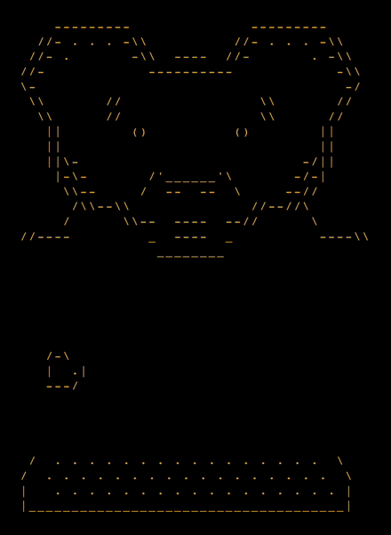

-- title

ASCII_BEAR

Using the keyboard, mic and mouse 
to make and ASCII character for 
streaming

More details here:

[alanwsmith.com/asciibear](https://www.alanwsmith.com/asciibear/index.html)

-- note

The iTerm2 script is no longer used. 
I'm wired to to pull the keyboard 
presses globally 

